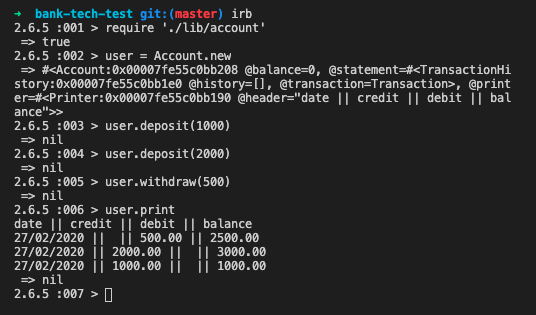

# Makers Bank Tech Test
[](https://codeclimate.com/github/Uvalente/bank-tech-test/maintainability)

On week 10 of Makers Academy we are tasked with completing differents tech tests, on a 2 days time limit.

Bank tech test is the first assigned.

## Getting started

1. Fork this repo, and clone it to your local machine, then cd to it
2. If you don't have bundle installed run the command `gem install bundle`
3. When the installation completes, run `bundle`

## Test

To run the tests, access the root folder and use
```
rspec
```

## Usage

To use this app, access the Ruby REPL with `irb` then:

```ruby
require './lib/account'

user = Account.new
user.deposit(1000)
user.deposit(2000)
user.withdraw(500)
user.print
```



## Approach & code structure

The code is structured in different classes, that are injected to each other to achieve an easily testable and changeable code.

I started with an Account class that can be instantiated, and provide methods for deposits and withdraws, changing the account balance to reflect the operation.

To create a statement for the account, those operations are then saved as Transaction instances and stored in an instance of TransactionHistory.

To print the statement Account relay on the Printer class.

Printer is responsible for returning the string to print, it has private methods for the table header, formattings and returning a string, extracting the values from an instance of Transaction.

## Requirements

* You should be able to interact with your code via a REPL like IRB or the JavaScript console.  (You don't need to implement a command line interface that takes input from STDIN.)
* Deposits, withdrawal.
* Account statement (date, amount, balance) printing.
* Data can be kept in memory (it doesn't need to be stored to a database or anything).


## Acceptance criteria

**Given** a client makes a deposit of 1000 on 10-01-2012  
**And** a deposit of 2000 on 13-01-2012  
**And** a withdrawal of 500 on 14-01-2012  
**When** she prints her bank statement  
**Then** she would see

```
date || credit || debit || balance
14/01/2012 || || 500.00 || 2500.00
13/01/2012 || 2000.00 || || 3000.00
10/01/2012 || 1000.00 || || 1000.00
```